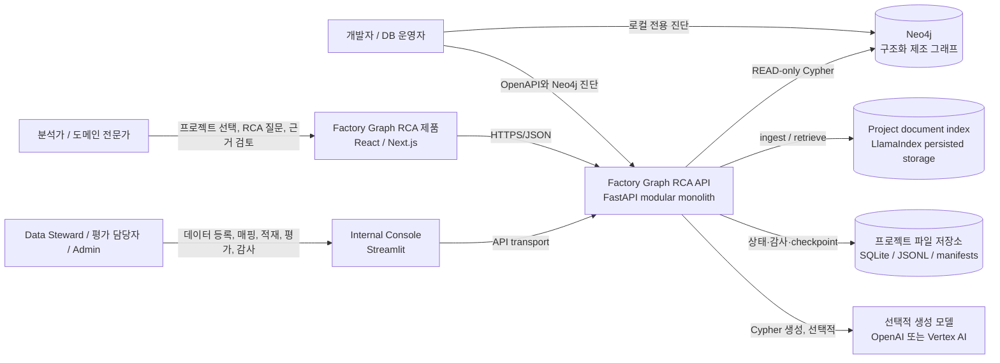
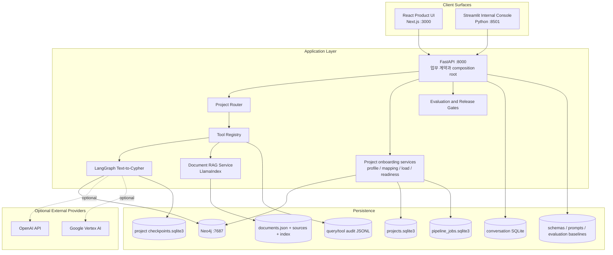
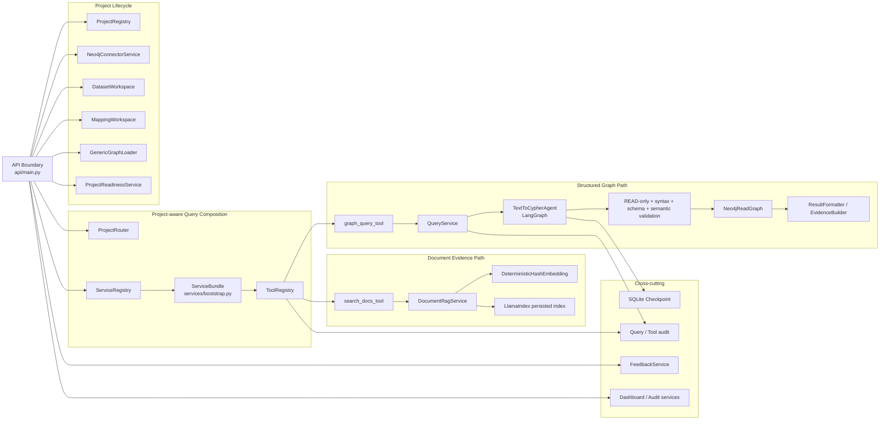
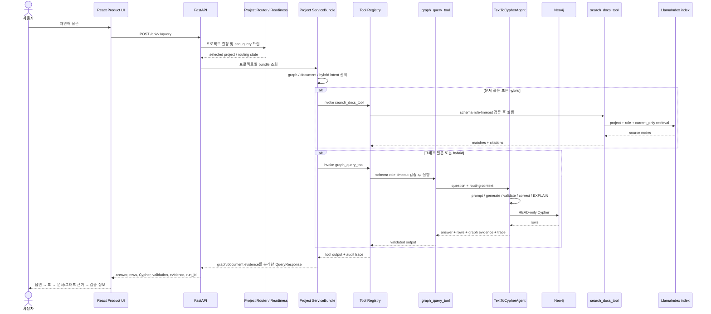
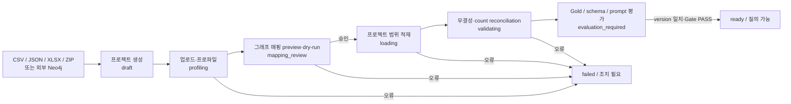
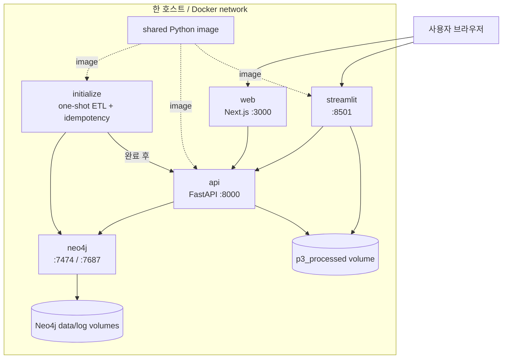
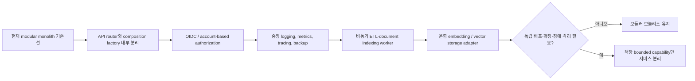

# 현재 시스템 아키텍처

문서 기준일: 2026-07-29
기준 커밋: `e582bf3`
기준 태그: `p3-stage3-4-v1`

## 1. 시스템 요약

Factory Graph RCA는 제조 데이터와 문서 지식을 프로젝트별로 격리하고, 사용자의 자연어 질문을 검증된 읽기 전용 그래프 질의 또는 문서 검색으로 처리해 답변·표·Cypher·그래프 경로·문서 citation을 함께 제공하는 시스템이다.

현재 아키텍처는 다음처럼 분류한다.

- 저장소 형태: monorepo
- 애플리케이션 구조: 모듈러 모놀리스
- 사용자 Surface: React/Next.js 제품 UI
- 내부 Surface: Streamlit 운영·데이터·평가 콘솔
- 업무 API: FastAPI
- 구조화 지식: Neo4j
- 비정형 문서 검색: LlamaIndex persisted vector index
- Agent orchestration: LangGraph 기반 Text-to-Cypher + 프로젝트 Router + Tool Registry
- 로컬 영속 상태: SQLite, JSONL, 파일 기반 index·manifest
- 배포: Docker Compose 5-service stack 또는 로컬/LAN 실행 스크립트

“모놀리스”는 경계가 없다는 뜻이 아니다. 현재 코드는 `projects`, `ingestion`, `mapping`, `etl`, `agent`, `tools`, `rag`, `services`, `api`로 책임이 나뉘며 하나의 FastAPI 프로세스 안에서 조합된다.

## 2. 핵심 사용자와 외부 시스템

### System Context



### 사용자별 주요 여정

| 사용자 | 기본 Surface | 주요 행동 |
|---|---|---|
| Viewer / Analyst | React | 프로젝트 선택, 자연어 질문, 답변·표·근거·History 확인 |
| Domain Expert | React | 결과 근거 검토, 전문가 판정 기록 |
| Data Steward | Streamlit | 파일·문서 등록, 프로파일, 매핑, 적재, readiness 확인 |
| Evaluation Owner | Streamlit | Gold·Blind·RAG 평가와 실패 분석 |
| Admin / Developer | Streamlit + FastAPI + Neo4j Browser | 운영 진단, API·DB·감사 확인 |

## 3. 컨테이너 구조



## 4. Surface 경계

| Surface | 책임 | 책임이 아닌 것 |
|---|---|---|
| React `web/` | 최종 사용자 제품, Projects → Query → Evidence/Graph → History, Expert Review | 데이터 적재, 평가 실행, 모델·provider 설정 |
| Streamlit `frontend/` | 내부 데이터·평가·운영 콘솔 | 최종 사용자 제품 랜딩과 별도 제품 UX |
| FastAPI `backend/app/api/` | 프로젝트·질의·문서·Tool·상태·감사의 공통 계약 | 브라우저별 상태를 별도 구현하는 것 |
| Neo4j Browser | 개발·DB 운영 진단 | 일반 사용자 제품 기능 |

React의 `/data`, `/schema`, `/operations`는 같은 기능을 다시 구현하지 않고 Streamlit의 해당 workspace로 프로젝트 컨텍스트를 유지해 연결한다.

## 5. 백엔드 컴포넌트 구조



### 주요 컴포넌트 책임

| 컴포넌트 | 코드 | 책임 |
|---|---|---|
| API Boundary | [`backend/app/api/main.py`](../../backend/app/api/main.py) | HTTP, schema, 오류 envelope, CORS·보안 헤더, 프로젝트 lifecycle과 서비스 호출 |
| Composition Root | [`backend/app/services/bootstrap.py`](../../backend/app/services/bootstrap.py) | 프로젝트별 Neo4j, model, Agent, RAG, Tool, audit를 하나의 `ServiceBundle`로 조합 |
| Project Router | [`backend/app/agent/project_router.py`](../../backend/app/agent/project_router.py) | 명시 프로젝트 우선, 자연어 기반 후보 선택, confidence·margin gate |
| Tool Registry | [`backend/app/tools/registry.py`](../../backend/app/tools/registry.py) | Pydantic I/O, 역할, timeout, retry, 오류 taxonomy, invocation audit |
| Tool Capabilities | [`backend/app/tools/capabilities.py`](../../backend/app/tools/capabilities.py) | graph, RCA, schema, ETL, evaluation, document search Tool 등록 |
| Text-to-Cypher | [`backend/app/agent/workflow.py`](../../backend/app/agent/workflow.py) | 생성, 검증, 자기수정, EXPLAIN, 실행, state·checkpoint |
| Document RAG | [`backend/app/rag/service.py`](../../backend/app/rag/service.py) | 문서 ingestion, version, 프로젝트·역할 격리, persist/reload, retrieval, citation |
| Project Lifecycle | [`backend/app/projects/`](../../backend/app/projects) | Registry, connector, readiness state machine |
| Data Intake | [`backend/app/ingestion/`](../../backend/app/ingestion), [`mapping/`](../../backend/app/mapping), [`etl/`](../../backend/app/etl) | multi-format source, profile, mapping, dry-run, 승인, 격리 적재 |
| Query Services | [`backend/app/services/`](../../backend/app/services) | 질의, 결과 formatting, graph, dashboard, feedback, audit |
| Evaluation | [`evaluation/`](../../evaluation) | Gold·Blind·RAG baseline, metrics, failure taxonomy |
| Release System | [`scripts/release_check.sh`](../../scripts/release_check.sh) | 전체 회귀, API, UI, Router, Tool, RAG, build, E2E, 문서 Gate |

## 6. 자연어 질의 동적 흐름



### 질의 경로 불변조건

- 준비되지 않은 프로젝트는 자유 질의를 실행하지 않는다.
- 프로젝트 ID는 Router, ServiceBundle, Neo4j query, RAG index와 audit에 유지된다.
- 쓰기 의도와 쓰기 Cypher는 모델 호출 전 또는 실행 전 차단된다.
- 검증되지 않은 Cypher는 Neo4j에 실행하지 않는다.
- 문서 citation은 실제 retrieval source node에서만 생성한다.
- graph evidence와 document evidence는 응답에서 별도 영역으로 유지한다.
- 외부 model 장애 시 허용된 경우 Gold query fallback을 사용한다.
- 모든 실행은 `run_id`와 Tool trace를 남긴다.

## 7. 데이터 온보딩과 readiness 흐름



### 문서 RAG ingestion

```mermaid
flowchart LR
    DOC[Markdown / TXT / text-layer PDF] --> META[project, document, version, role metadata]
    META --> HASH[source SHA-256 + duplicate check]
    HASH --> CHUNK[LlamaIndex document/chunk nodes]
    CHUNK --> EMB[deterministic embedding for local/LAN/CI]
    EMB --> PERSIST[project-scoped persisted index]
    PERSIST --> SEARCH[current/superseded + role filter]
    SEARCH --> CITE[source-backed citation]
```



스캔 PDF OCR, cloud vector DB, production multilingual embedding과 reranker는 현재 범위 밖이다.

## 8. 저장 데이터와 source of truth

| 데이터 | 저장 위치 | source of truth / 특성 |
|---|---|---|
| 구조화 제조 사실 | Neo4j | 프로젝트 범위의 노드·관계·속성 |
| 프로젝트 lifecycle | `data/processed/projects.sqlite3` | ProjectRegistry 상태와 active project |
| pipeline jobs | `data/processed/pipeline_jobs.sqlite3` | 내부 작업 상태와 로그 |
| 대화 기록 | SQLite 기반 conversation store | 프로젝트별 History |
| LangGraph run state | 프로젝트별 `checkpoints.sqlite3` | 재시작 후 state 복구 |
| Query audit | 프로젝트별 `query_audit.jsonl` | append-oriented 질의 추적 |
| Tool audit | 프로젝트별 `tool_audit.jsonl` | invocation, 역할, 입력 hash, 오류 |
| 전문가 판정 | `expert_feedback.jsonl` | append-only review evidence |
| RAG manifest·source·index | `data/processed/.../rag/` | 프로젝트별 문서와 persisted index |
| Schema | `schemas/<project_id>/` | versioned graph contract |
| Prompt | `prompts/<project_id>/` | Agent contract와 few-shot 연결 |
| 평가 기준선 | `evaluation/` | Gold·Blind·Router·Tool·RAG metrics |

현재 파일·SQLite 기반 저장은 로컬·LAN·단일 인스턴스 MVP에 적합하다. 다중 인스턴스 동시 쓰기, 고가용성, 중앙 감사와 계정 기반 권한이 필요하면 운영 DB와 object/vector storage로 이전해야 한다.

## 9. 배포 토폴로지

### Docker Compose 제품 스택



Compose 기본 포트는 loopback에만 bind된다. LAN 공유는 `scripts/run_lan.sh`가 React·FastAPI·Streamlit을 `0.0.0.0`에 실행하되 Neo4j Browser와 Bolt는 외부에 공개하지 않는다.

### 서비스 시작 순서

```text
Neo4j health PASS
  → initialize ETL 및 멱등성 확인 완료
  → FastAPI health PASS
  → Streamlit과 Next.js 시작
```

## 10. 품질·보안 아키텍처

### 자동 fitness functions

현재 `scripts/release_check.sh`는 아키텍처 적합성 검사 역할도 수행한다.

- Python 전체 회귀
- OpenAPI·traceability·secret contract
- UI 품질과 Surface 경계
- 제품 사용자 release contract
- Project Router 평가
- Tool Registry contract
- LlamaIndex RAG contract
- Next.js lint와 production build
- Playwright 제품 사용자 여정
- script syntax와 container contract
- 필수 문서 존재 여부

### 주요 보안 경계

- Neo4j read-only 실행 정책과 쓰기 키워드 차단
- Pydantic Tool input/output validation
- 역할 기반 Tool·문서 접근 필터
- 프로젝트별 Neo4j scope와 RAG 물리·논리 격리
- CORS allowlist, no-store, clickjacking 방지 보안 헤더
- secret scan과 환경변수 기반 credential
- audit에 raw 민감 입력 대신 hash·식별자 기록

### 현재 한계

- 사용자 계정·OIDC 기반 인증은 아직 없다.
- 역할은 현재 제품화된 실제 identity provider가 아니라 서버·데모 컨텍스트 중심이다.
- Neo4j Community 기반 배포는 세밀한 DB 권한과 다중 DB 운영에 제약이 있다.
- 파일 기반 audit와 SQLite는 중앙 운영·다중 인스턴스에 적합하지 않다.

## 11. 코드 구조상 주의할 hotspot

현재 구조는 동작하고 Gate가 강하지만 다음 파일은 변경 집중도가 높다.

| 파일 | 현재 규모 | 위험 | 권장 방향 |
|---|---:|---|---|
| `backend/app/api/main.py` | 약 1,469 lines | lifecycle, query, documents, tools, audit route가 한 composition 함수에 집중 | 도메인별 `APIRouter`로 분리하되 공통 error·registry는 유지 |
| `backend/app/services/bootstrap.py` | 약 571 lines | provider, Neo4j, Agent, RAG, Tool 조합과 fallback이 결합 | `ProjectBundleFactory`와 capability provider로 단계적 분리 |
| `backend/app/agent/workflow.py` | 약 643 lines | Agent state, generation, validation, execution 변경 영향이 큼 | LangGraph node별 계약과 state migration test 유지 |
| `backend/app/rag/service.py` | 약 496 lines | ingestion, manifest, index lifecycle, retrieval이 함께 있음 | storage adapter와 retrieval policy를 인터페이스로 분리 |

이 파일들을 곧바로 별도 서비스로 만드는 것은 권장하지 않는다. 먼저 같은 프로세스 안에서 route·factory·adapter 경계를 명확히 만들고 테스트를 유지하는 편이 안전하다.

## 12. 모듈 소유권

| 영역 | 기본 Owner | 교차 검토 |
|---|---|---|
| `ingestion/`, `mapping/`, `etl/` | Data·ETL Owner | Graph Schema Owner |
| `schema_registry.py`, `schemas/` | Graph Schema Owner | Evaluation Owner |
| `agent/`, `tools/`, `rag/`, `security/` | Agent·Security Owner | Evaluation Owner |
| `projects/`, `api/`, `services/` | Platform Owner | UI·Evidence Owner |
| `frontend/`, `web/` | UI·Evidence Owner | Platform Owner |
| `evaluation/` | Evaluation Owner | 변경 영역 Owner |
| `infra/`, `scripts/`, `.github/` | Release Manager | 변경 영역 Owner |

실제 담당자 이름은 [`docs/module-ownership.md`](../module-ownership.md)에 기록한다.

## 13. 현재 아키텍처 판정

### 강점

- 제품과 내부 콘솔의 책임이 분리되어 있다.
- FastAPI가 공통 source of truth 역할을 한다.
- 프로젝트별 schema, prompt, graph, RAG, audit 경계가 있다.
- Agent 실행에 validation, fallback, checkpoint와 Tool audit가 있다.
- 평가와 제품 사용자 흐름이 자동 Gate로 고정되어 있다.
- 두 번째 도메인으로 재사용성을 검증했다.

### 기술 부채와 위험

- 실제 인증·인가와 계정 기반 문서 권한이 없다.
- API와 composition root가 커져 변경 충돌 가능성이 높다.
- Streamlit과 React를 함께 유지하므로 공통 계약이 깨지면 이중 회귀가 발생한다.
- RAG deterministic embedding은 데모·CI 재현성을 위한 것으로 운영 의미 품질을 대표하지 않는다.
- SQLite·JSONL·로컬 persisted index는 단일 인스턴스 전제다.
- 장시간 ETL·색인을 위한 외부 queue/worker가 없다.
- 중앙 observability, alert, SLO와 재해 복구 정책이 없다.
- 자동 제품 Gate는 통과했지만 실제 사용자 무설명 수동 검토가 남아 있다.

## 14. 권장 진화 순서



### 우선순위

1. 실제 사용자 수동 Gate 완료
2. CODEOWNERS·PR·ADR 운영
3. API route와 composition root의 내부 모듈화
4. 인증·인가와 위협 모델
5. 중앙 관측성·백업·복구
6. 비동기 worker와 운영 RAG 인프라
7. 실제 지표가 요구할 때 서비스 분리

## 15. 서비스 분리 판단 기준

| 후보 | 지금 분리하지 않는 이유 | 분리 trigger |
|---|---|---|
| Document RAG | 현재 API와 같은 프로젝트·권한·audit 계약을 공유 | 색인 부하, 별도 GPU/vector DB, 독립 배포가 필요할 때 |
| ETL / Pipeline Worker | 현재 데이터 규모와 로컬 운영에서는 동기·내부 job으로 가능 | 장시간 실행, 재개·취소, 큐, 수평 확장이 필요할 때 |
| Agent Runtime | Tool·project context와 강하게 결합 | 다른 제품이 공통 Agent runtime을 독립 호출하거나 별도 scaling이 필요할 때 |
| Audit Service | 파일 기반 조회로 현재 데모·검증 충족 | 규제 보존, 중앙 검색, 불변 storage, 외부 SIEM 연동이 필요할 때 |
| Frontend BFF | FastAPI 계약을 두 UI가 직접 공유 가능 | 클라이언트별 집계·캐시·인증 세션 요구가 크게 달라질 때 |

## 16. 팀 온보딩용 빠른 읽기 순서

1. [`README.md`](../../README.md): 제품 목표와 실행
2. [`docs/architecture/current-state.md`](./current-state.md): 전체 구조
3. [`docs/architecture/adr/`](./adr/README.md): 결정 이유
4. [`docs/api-contract.md`](../api-contract.md): HTTP 계약
5. [`docs/module-ownership.md`](../module-ownership.md): 책임과 리뷰
6. 관심 영역의 `enterprise-stage*` 검증 문서
7. `scripts/release_check.sh`: 실제 완료 기준

팀원은 코드를 수정하기 전에 담당 영역의 입력·출력, 저장 데이터, 보안 경계와 실행할 Gate를 설명할 수 있어야 한다.
