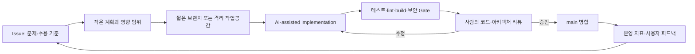

# 바이브 코딩 MVP에서 팀 엔지니어링으로

문서 기준일: 2026-07-29
대상: 제품 책임자, 개발자, 데이터·AI 담당자, 아키텍처 리뷰 참여자

## 1. 결론

바이브 코딩으로 만든 MVP를 버리고 처음부터 다시 만드는 것이 정답은 아니다. 현재 동작하는 제품을 **검증 가능한 기준선**으로 고정한 뒤, 빠르게 만들어진 코드를 팀이 이해하고 변경할 수 있도록 구조·계약·테스트·의사결정 기록을 추가하는 방식이 현실적이다.

이 프로젝트에 권장하는 방향은 다음과 같다.

```text
아이디어 검증 속도
  → 동작하는 MVP
  → 코드·데이터·사용자 흐름 인벤토리
  → C4형 구조 문서와 ADR
  → 모듈 경계와 API 계약 고정
  → 자동 Gate와 코드 리뷰
  → 팀 공동 소유
  → 측정 가능한 병목이 생긴 부분만 분리
```

현재 저장소는 이미 FastAPI 경계, 프로젝트 격리, Tool Registry, 평가 Gate, 두 UI의 Surface 분리와 전체 회귀 테스트를 갖추고 있다. 따라서 “재작성”보다 **현재 모듈러 모놀리스를 공식화하고 팀 개발 규칙을 세우는 단계**가 먼저다.

## 2. 용어를 명확히 구분한다

Simon Willison은 바이브 코딩을 AI가 만든 코드를 충분히 이해하거나 책임지지 않은 채 계속 수용하는 방식으로 구분한다. 아이디어 탐색과 저위험 프로토타입에는 유용하지만, 운영 코드에서는 작성자가 동작을 이해하고 설명·검증할 수 있어야 한다고 강조한다.

팀에서는 다음처럼 구분해 사용하는 것이 좋다.

| 구분 | 목적 | 허용 수준 | 완료 조건 |
|---|---|---|---|
| Vibe prototype | 문제와 UX를 빠르게 검증 | 임시 구조, 제한된 테스트 허용 | 버릴 수 있고 운영 데이터에 접근하지 않음 |
| AI-assisted engineering | 팀이 소유할 기능 구현 | AI가 코드를 작성해도 됨 | 사람이 리뷰·테스트·설명하고 PR로 병합 |
| Production engineering | 실제 사용자·데이터·운영 | 보안·복구·관측·성능까지 관리 | 명시된 SLO·Gate·승인·롤백 충족 |

핵심은 AI가 몇 퍼센트의 코드를 작성했는지가 아니라 **누가 의사결정과 품질에 책임지는가**다.

## 3. 최근 전문가 근거와 사례

### 3.1 공통적으로 반복되는 메시지

최근 연구와 기업 사례는 서로 다른 결과를 보고하지만, 다음 결론에는 대체로 수렴한다.

1. AI는 새 UI, 보일러플레이트, 탐색적 MVP를 매우 빠르게 만든다.
2. 운영 단계의 병목은 코드 입력이 아니라 이해, 통합, 검증, 보안, 유지보수다.
3. 명확한 사양, 작은 작업 단위, 좋은 저장소 문서, 테스트와 빠른 피드백이 있을수록 결과가 좋아진다.
4. AI 도입은 약한 개발 프로세스를 자동으로 고치지 않는다. 좋은 플랫폼과 구조는 증폭되고, 혼란스러운 구조도 함께 증폭된다.
5. 생산성은 상황에 따라 크게 다르므로 생성된 코드량이 아니라 리드타임, 실패율, 재작업, 리뷰 부담과 사용자 결과로 측정해야 한다.

### 3.2 추천 읽기 목록

| 자료 | 작성자·기관 | 핵심 내용 | 이 프로젝트에 적용할 점 |
|---|---|---|---|
| [Will the future of software development run on vibes?](https://simonwillison.net/2025/Mar/6/vibe-coding/) | Simon Willison, 2025-03-06 | 바이브 코딩은 프로토타입에는 유용하지만 이해하지 못한 코드를 운영에 투입하면 안 된다고 구분한다. | 현재 MVP를 보존하되, 모든 운영 코드에 리뷰·테스트·설명 가능성을 요구한다. |
| [Vibe engineering](https://simonwillison.net/2025/Oct/7/vibe-engineering/) | Simon Willison, 2025-10-07 | 숙련자가 LLM을 활용하면서도 결과에 책임지는 방식을 바이브 엔지니어링으로 설명한다. | 팀의 목표를 “프롬프트로 만들기”가 아니라 “AI를 사용해 검증된 변경을 만들기”로 정한다. |
| [The 70% problem: Hard truths about AI-assisted coding](https://addyo.substack.com/p/the-70-problem-hard-truths-about) | Addy Osmani, 2024-12-04 | 첫 70%는 빠르지만 보안, 예외, 통합, 접근성, 유지보수가 남은 어려운 30%라고 설명한다. | Definition of Done에 예외·보안·접근성·통합·운영 검증을 명시한다. |
| [2025 DORA State of AI-assisted Software Development](https://cloud.google.com/blog/products/ai-machine-learning/announcing-the-2025-dora-report) | Nathen Harvey, Derek DeBellis, Google Cloud DORA, 2025-09-23 | 약 5,000명의 데이터를 바탕으로 AI는 기존 팀 역량을 증폭하며, 느슨한 결합·빠른 피드백·좋은 내부 플랫폼이 중요하다고 보고한다. | 테스트, 릴리스 Gate, 명확한 워크플로와 모듈 경계를 AI 도입보다 먼저 강화한다. |
| [Claude Code: Best practices for agentic coding](https://www.anthropic.com/engineering/claude-code-best-practices) | Anthropic Engineering, 2025-04-18 | 저장소 지침, 작은 작업, 테스트, 도구 권한과 반복 가능한 환경이 에이전트 성능을 좌우한다고 설명한다. | 저장소 지침, 실행 명령, 모듈 책임, 검증 명령을 Git에 함께 관리한다. |
| [Spec-driven development with AI](https://github.blog/ai-and-ml/generative-ai/spec-driven-development-with-ai-get-started-with-a-new-open-source-toolkit/) | Den Delimarsky, GitHub, 2025-09-02 | 모호한 프롬프트 대신 명세·계획·작업 단위로 AI 변경을 통제하는 방식을 제안한다. | 기능 요구, 수용 기준, API 계약, 테스트를 이슈와 PR에 먼저 기록한다. |
| [Introducing Roast: Structured AI workflows made easy](https://shopify.engineering/introducing-roast) | Obie Fernandez, Shopify Engineering, 2025-06-18 | 거대한 프롬프트보다 복잡한 작업을 결정적 단계로 나누는 것이 신뢰성을 높였다고 설명한다. | 데이터 온보딩, Agent 변경, UI 변경을 각각 검증 가능한 단계로 분리한다. |
| [1,500+ PRs Later: Spotify’s Journey with Our Background Coding Agent](https://engineering.atspotify.com/2025/11/spotifys-background-coding-agent-part-1) | Max Charas, Marc Bruggmann, Spotify Engineering, 2025-11-06 | 1,500개 이상의 AI 생성 PR을 운영 코드에 병합하면서 컨텍스트, 샌드박스, 품질 제어가 핵심이라고 보고한다. | AI가 직접 main을 수정하지 않고 격리된 브랜치·PR·Gate를 거치게 한다. |
| [Background Coding Agents: Context Engineering](https://engineering.atspotify.com/2025/11/context-engineering-background-coding-agents-part-2) | Spotify Engineering, 2025-11 | 실제 코드베이스에서는 저장소 컨텍스트와 명확한 마이그레이션 사양이 병합 가능한 결과를 만든다고 설명한다. | 모듈별 목적·금지사항·테스트를 문서로 제공한다. |
| [Background Coding Agents: Predictable Results Through Strong Feedback Loops](https://engineering.atspotify.com/2025/12/feedback-loops-background-coding-agents-part-3) | Spotify Engineering, 2025-12 | 빌드·테스트·정적 분석 같은 강한 피드백 루프가 에이전트 결과를 예측 가능하게 만든다고 설명한다. | 현재 `release_check.sh`를 PR 필수 Gate로 승격한다. |
| [Measuring the Impact of Early-2025 AI on Experienced Open-Source Developer Productivity](https://metr.org/blog/2025-07-10-early-2025-ai-experienced-os-dev-study/) | Joel Becker, Nate Rush, Beth Barnes, David Rein, METR, 2025-07-10 | 익숙한 성숙 코드베이스의 숙련 개발자 16명·246개 작업에서 당시 AI 사용이 완료 시간을 19% 늘린 RCT 결과를 보고했다. | AI 사용 효과를 가정하지 말고 리뷰 시간·재작업·결함과 함께 측정한다. |
| [Agentic coding and persistent returns to expertise](https://www.anthropic.com/research/claude-code-expertise) | Anthropic Research, 2026-06-16 | 약 40만 세션 분석에서 사람이 주로 계획을 정하고 에이전트가 실행을 맡으며, 도메인 전문성이 성공과 연결된다고 보고한다. | 도메인 전문가와 아키텍처 책임자가 문제·제약·수용 기준을 먼저 정한다. |
| [Vibe Coding in Software Development: A Multivocal Literature Review](https://arxiv.org/abs/2607.21652) | Siddeeq et al., 2026-07-22, preprint | 47개 학술·실무 자료를 종합해 프로토타이핑 이점은 강하지만 장기 유지보수와 운영 품질 근거는 아직 제한적이라고 정리한다. | MVP 속도는 활용하되 운영 전환은 별도 엔지니어링 단계로 취급한다. |

### 3.3 사례를 과장하지 않는 방법

팀 공유 자료에서는 다음 두 문장을 함께 제시하는 것이 신뢰도가 높다.

- Spotify와 Shopify 사례처럼 구조화된 컨텍스트와 자동 검증이 있는 조직에서는 AI가 대규모 변경을 크게 가속할 수 있다.
- METR의 RCT처럼 익숙하고 복잡한 기존 코드에서는 검토와 수정 비용 때문에 오히려 느려질 수도 있다.

즉, “AI가 항상 빠르다”가 아니라 **문제 유형과 엔지니어링 시스템이 성과를 결정한다**고 설명해야 한다.

## 4. 권장 전환 모델

### 단계 0. 동작하는 기준선 고정

- main의 현재 동작 상태를 태그로 고정한다.
- 제품 사용자 흐름, API, 데이터셋, 외부 의존성과 실행 방법을 기록한다.
- 전체 회귀 테스트와 제품 Gate를 한 명의 로컬 환경에서 재현한다.
- 미검증 항목은 완료처럼 쓰지 않는다.

현재 프로젝트는 `p3-stage3-4-v1` 태그와 전체 자동 Gate가 이 역할을 한다.

### 단계 1. 제품과 시스템 경계 합의

팀이 가장 먼저 합의해야 할 질문은 프레임워크가 아니라 다음 세 가지다.

1. 사용자는 누구이며 어떤 문제를 해결하는가?
2. 최종 제품 화면과 내부 운영 화면은 무엇인가?
3. 시스템의 source of truth와 신뢰 경계는 어디인가?

현재 결정:

- React: 최종 사용자 제품
- Streamlit: 내부 운영·데이터·평가 콘솔
- FastAPI: 공통 업무 계약과 source of truth
- Neo4j: 구조화 제조 사실
- LlamaIndex persisted index: 문서 근거

### 단계 2. 구조를 그린 뒤 코드와 연결

C4 모델의 System Context와 Container 수준을 기본으로 사용한다. 대부분의 팀은 이 두 수준만으로도 충분하며, 변경이 잦은 영역에만 Component 수준을 추가한다.

각 박스에는 최소한 다음 정보가 있어야 한다.

- 책임
- 기술
- 소유 팀 또는 역할
- 입력·출력 계약
- 저장 데이터
- 장애가 미치는 범위
- 코드 경로

현재 구조는 [`current-state.md`](./current-state.md)에 기록한다.

### 단계 3. 결정 이유를 ADR로 남긴다

아키텍처 문서만 있으면 “무엇”은 알 수 있지만 “왜”는 사라진다. 구조적으로 중요한 선택은 짧은 ADR로 남긴다.

ADR 대상 예시:

- React와 Streamlit의 역할 분리
- FastAPI를 source of truth로 유지
- 모듈러 모놀리스를 당분간 유지
- Neo4j와 문서 RAG 근거를 분리
- deterministic embedding을 데모·CI에만 사용
- 인증·비동기 작업 큐·cloud vector DB 도입 시점

형식은 `상태 / 맥락 / 결정 / 결과 / 대안`이면 충분하다.

### 단계 4. 명세와 검증을 AI의 입력으로 만든다

AI에게 “기능을 만들어 줘”라고 지시하기 전에 다음을 제공한다.

```text
문제와 사용자 결과
영향받는 모듈
변경하지 말아야 할 경계
API·데이터 계약
수용 기준
실행할 테스트와 Gate
보안·권한·프로젝트 격리 조건
```

작업은 한 PR에서 리뷰 가능한 크기로 나눈다. 생성된 코드가 많을수록 더 큰 PR을 만드는 것이 아니라 더 작은 검증 단위로 쪼개야 한다.

### 단계 5. 팀 개발 흐름을 고정한다

권장 기본 흐름:



필수 규칙:

- AI는 보호된 main에 직접 push하지 않는다.
- 모든 PR은 문제, 변경 이유, 테스트 결과, 위험과 롤백을 포함한다.
- 아키텍처 변경은 ADR과 다이어그램을 같은 PR에서 갱신한다.
- 보안과 데이터 접근 변경은 해당 소유자의 별도 승인을 받는다.
- 생성 코드 비율은 KPI로 사용하지 않는다.

### 단계 6. 실제 병목이 생길 때만 분리한다

초기 팀이 흔히 하는 실수는 MVP를 곧바로 마이크로서비스로 다시 만드는 것이다. 현재 시스템은 한 저장소와 한 배포 스택 안에서 모듈 경계가 비교적 명확하므로 우선 모듈러 모놀리스를 유지한다.

서비스 분리를 검토할 수 있는 신호:

- 특정 영역만 독립적으로 자주 배포해야 한다.
- 한 영역의 장애가 전체 API를 반복적으로 중단시킨다.
- 처리량·메모리·GPU 요구가 다른 영역과 현저히 다르다.
- 데이터 보안 또는 규제 경계가 별도 프로세스를 요구한다.
- 담당 팀이 독립적으로 운영할 수 있을 만큼 커졌다.
- 비동기 ETL이나 문서 색인이 API 요청 생명주기 안에서 감당되지 않는다.

“파일이 많아졌다” 또는 “마이크로서비스가 더 전문적으로 보인다”는 분리 근거가 아니다.

## 5. 현재 프로젝트에 대한 적용 평가

### 이미 갖춘 기반

- main·태그·단계별 독립 커밋
- React 제품과 Streamlit 내부 콘솔의 명확한 Surface
- FastAPI 중심의 공통 계약
- 프로젝트 Registry·readiness·프로젝트 격리
- LangGraph state와 checkpoint
- Tool Registry의 I/O schema, 권한, timeout, retry, audit
- Neo4j READ-only 검증과 쓰기 차단
- Gold·Blind·RAG 평가 기준선
- 전체 Python 회귀, lint, build, Playwright, 릴리스 Gate
- 모듈 소유권 초안

### 팀 전환을 위해 추가할 것

- CODEOWNERS 또는 PR 승인 규칙
- 루트 저장소 지침 파일과 로컬 개발 표준
- 이슈·PR 템플릿
- ADR 운영 규칙과 초기 ADR
- API와 이벤트 계약의 변경 정책
- 사용자 계정 기반 인증·인가 설계
- 운영 환경의 관측성: 로그 집계, metrics, traces, alert
- 백업·복구·데이터 보존 정책
- 실제 사용자 수동 검토 완료
- deterministic RAG embedding과 파일 기반 저장의 운영 대체 계획

## 6. 30일 실행안

### 1주차 — 공유 가능한 기준선

- 모든 팀원이 fresh checkout에서 제품을 실행한다.
- `current-state.md`를 함께 리뷰하고 잘못된 박스·흐름을 수정한다.
- 역할별 코드 소유자를 지정한다.
- main 보호, PR 필수, 최소 1인 리뷰를 설정한다.
- 실제 사용자 수동 검토를 수행하고 막힌 지점을 기록한다.

완료 기준: 팀원이 설명 없이 저장소를 실행하고 주요 흐름과 모듈 책임을 설명할 수 있다.

### 2주차 — 변경 프로세스

- 이슈·PR 템플릿을 적용한다.
- 아키텍처 변경은 ADR 필수로 정한다.
- CI에서 `release_check.sh`의 현실적인 하위 Gate를 병렬 실행한다.
- 변경 크기, 리뷰 시간, 재작업 횟수, 결함을 기록한다.

완료 기준: AI 사용 여부와 무관하게 모든 변경이 같은 품질 절차를 거친다.

### 3주차 — 위험 경계 보강

- 인증·인가 목표 구조를 ADR로 설계한다.
- secret, 문서 권한, 프로젝트 격리 위협 모델을 작성한다.
- 백업·복구와 운영 장애 시나리오를 테스트한다.
- API 대형 composition root와 라우트 파일 분리 계획을 세운다.

완료 기준: 누가 어떤 데이터에 접근하며 장애 시 어떻게 복구하는지 설명할 수 있다.

### 4주차 — 다음 분기 구조 결정

- 실제 사용자 피드백과 운영 지표를 바탕으로 우선순위를 정한다.
- 인증, 비동기 작업 큐, 운영 embedding, 외부 배포 중 필요한 것만 선택한다.
- 서비스 분리 여부는 위의 측정 가능한 trigger로 판단한다.
- 다음 4~8주의 ADR·기능 roadmap을 확정한다.

완료 기준: “기술을 도입하고 싶다”가 아니라 “어떤 사용자·운영 문제를 어떤 구조로 해결한다”는 계획이 있다.

## 7. 팀 Definition of Done

기능은 다음 조건을 모두 충족할 때 완료다.

- 사용자 결과와 수용 기준이 이슈에 기록되어 있다.
- 영향받는 아키텍처 경계와 데이터가 식별되어 있다.
- API·schema·권한 변경이 계약과 문서에 반영되어 있다.
- 정상·빈 결과·실패·권한 거부·재시도 경로가 검증됐다.
- 단위·통합·브라우저 또는 적절한 Gate가 통과했다.
- 보안·프로젝트 격리·secret 회귀가 없다.
- 운영 로그와 오류가 재현 가능한 식별자를 남긴다.
- 사람이 변경 내용을 설명하고 유지보수할 수 있다.
- 필요한 ADR과 다이어그램이 갱신됐다.
- 롤백 또는 안전한 비활성화 방법이 있다.

## 8. 권장 아키텍처 문서 세트

팀 규모가 작을 때는 문서를 늘리기보다 다음 세트를 최신으로 유지한다.

1. System Context와 Container 다이어그램
2. 핵심 동적 흐름 2~4개
3. 모듈·데이터·배포 책임표
4. ADR
5. API/OpenAPI와 schema contract
6. 운영 runbook과 Release Gate

이 저장소에서는 위 세트를 `docs/architecture/`, 기존 `docs/api-contract.md`, `docs/module-ownership.md`, `scripts/release_check.sh`로 구성한다.
