# P3 백엔드 데이터·스키마·ETL·평가 Lineage

## 1. 전체 계보

```mermaid
flowchart LR
  A["원본 파일 또는 외부 Neo4j"] --> B["Source profile · SHA-256"]
  B --> C["Mapping review 또는 Schema introspection"]
  C --> D["Versioned schema.yml"]
  D --> E["ETL load 또는 External DB attach"]
  E --> F["Integrity · READ-only evidence"]
  F --> G["Gold·Blind manifest와 snapshot"]
  G --> H["Versioned prompt manifest"]
  H --> I["Blind metrics"]
  I --> J["Readiness gate"]
  J --> K["Text-to-Cypher query"]
  K --> L["Cypher SHA-256 · Evidence · Audit"]
```



## 2. 단계별 단일 기준

| 단계 | 식별자·버전 | 저장 위치 | 검증 |
|---|---|---|---|
| 원본 | upload ID, 파일 SHA-256 | `data/processed/project_uploads/` | 크기·확장자·경로·hash |
| 외부 DB | connector ID, schema fingerprint | `data/processed/project_connectors/` | READ 연결·노드/관계 건수 |
| Mapping | upload ID, schema version | `data/processed/project_mappings/` | dry-run·타입·고아·중복 |
| Schema | source version, schema version | `schemas/{project}/schema.yml` | DSL·질의 시나리오 |
| ETL | upload ID, load report | `data/processed/**/etl_runs/` | reconciliation·project scope |
| Gold·Blind | evaluation version, fingerprint | `evaluation/projects/{project}/` | 질문 수·READ-only·snapshot |
| Prompt | prompt version, fingerprint | `prompts/{project}/manifest.yml` | schema·evaluation 일치 |
| 평가 | metrics fingerprint | `evaluation/**/metrics.json` | 현재 4개 version 일치 |
| 운영 질의 | request/query fingerprint | project별 audit JSONL | 검증 Cypher hash·상태·근거 |

런타임의 `project_artifacts` 테이블에는 source, connector/mapping, schema,
load, integrity, read_only, prompt, gold, evaluation의 최신 version과
fingerprint가 연결된다.

## 3. Readiness 동치 조건

자유 질의 가능 조건은 다음 조건의 AND다.

1. 검증된 source가 있다.
2. project metadata와 schema의 source/schema version이 같다.
3. 승인된 mapping 또는 connector가 있다.
4. 그래프 무결성과 READ 계약이 PASS다.
5. Gold·Blind 질문과 snapshot이 현재 schema/source를 참조한다.
6. Prompt가 현재 schema/evaluation을 참조한다.
7. Blind metrics가 현재 source/schema/prompt/evaluation version과 같다.
8. 실제 그래프에 노드가 존재한다.
9. lifecycle이 `ready`다.

하나라도 바뀌면 기존 평가 결과를 새 데이터에 재사용하지 않는다.

## 4. 재현 명령

```bash
# 기존 개발환경의 전체 회귀
./scripts/release_check.sh

# 로컬 Python/Node 의존성 없이 새 Docker volume에서 검증
./scripts/fresh_release_gate.sh
```

두 번째 명령은 임시 비밀번호를 임시 파일에 만들고, Compose build →
CiP-DMD 적재·멱등성 → API/Streamlit/Next.js 시작 → HTTP black-box E2E →
volume 삭제까지 수행한다.

## 5. 보관·비밀 경계

- 원본 업로드, connector profile, SQLite registry, audit log는 Git에서
  제외한다.
- 외부 Neo4j connector는 password 값이 아니라 환경변수 이름만 저장한다.
- 평가 질문·snapshot·metrics와 schema·prompt manifest는 재현 근거이므로
  Git에서 관리한다.
- 실제 고객 데이터의 보존기간·삭제·암호화 정책은 배포 환경의 데이터
  거버넌스에서 별도로 정한다.
