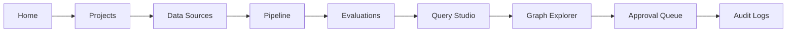

# 엔터프라이즈 2-1 — 정보구조·디자인 시스템

## 1. 완료 범위

통합 기능명세 5장의 11개 작업공간을 Streamlit의 공식 정보구조로
고정했다. 이 단계는 후속 화면의 업무 기능을 미리 완성한 단계가 아니라,
화면 이름·역할별 접근·공통 상태·시각 언어·React 경계를 코드 계약으로
만든 단계다.

구현 근거:

- `frontend/design_system.py`
  - 11개 작업공간과 역할별 메뉴
  - 디자인 토큰
  - `ready/loading/empty/error` 상태 계약
  - 핵심 사용자 wireflow
  - Streamlit·React·Backend 소유권 경계
- `frontend/streamlit_app.py`
  - 역할 미리보기와 권한별 내비게이션
  - 공통 페이지 헤더·상태 카드
  - 기존 화면을 새 정보구조에 연결
- `tests/test_design_system.py`
  - IA·RBAC·상태·토큰·wireflow·UI 경계 자동 검증

## 2. 정보구조

| 그룹 | 작업공간 | 현재 연결 | 후속 단계 |
|---|---|---|---|
| Overview | Home | 제품 랜딩 | 2-1 |
| Overview | Projects | 프로젝트 Registry 기반 | 2-2 |
| Data foundation | Data Sources | 업로드·프로파일·Data Intake | 2-3 |
| Data foundation | Pipeline | 매핑 검토·승인 적재 | 2-3 |
| Investigation | Query Studio | 질의·답변·인라인 근거 | 2-4 |
| Investigation | Graph Explorer | 검색·부분 그래프 | 2-5 |
| Investigation | Dashboard | 그래프·품질·Agent 지표 | 2-6 |
| Governance | Evaluations | 화면 셸 | 2-6 |
| Governance | Approval Queue | 화면 셸 | 3-6 |
| Governance | Audit Logs | 화면 셸 | 3-7 |
| Administration | Admin | 화면 셸 | 3-8 |

화면 셸은 기능이 완성된 것처럼 보이지 않도록 후속 구현 단계를
명시한다. 기존 `Data & Health`, `Schema Studio`, `Operations` 명칭은
각각 `Data Sources`, `Pipeline`, `Dashboard`로 정규화했다.
`Evidence Lab`은 별도 이동을 요구하는 구조를 폐기하고 Query Studio의
답변 직하 근거 영역으로 유지한다.

## 3. 역할별 접근

| 작업공간 | Viewer | Analyst | Domain Expert | Data Steward | Admin |
|---|:---:|:---:|:---:|:---:|:---:|
| Home·Projects | O | O | O | O | O |
| Data Sources·Pipeline | - | - | - | O | O |
| Query Studio·Graph Explorer·Dashboard | O | O | O | O | O |
| Evaluations·Audit Logs | - | O | O | O | O |
| Approval Queue | - | - | O | O | O |
| Admin | - | - | - | - | O |

현재 역할 선택기는 2-1 설계를 검증하는 **프로토타입 미리보기**다.
실제 인증·SSO와 서버 측 권한 집행을 대신하지 않는다. 운영 버전에서는
인증 토큰의 role claim과 FastAPI 권한 검사를 함께 적용해야 한다.

## 4. 핵심 wireflow

별도 운영 점검 흐름은 `Dashboard → Evaluations → Audit Logs`다.
모든 wireflow의 화면 이름은 자동 테스트에서 선언된 IA와 대조한다.

## 5. 디자인 시스템

### 토큰

- 색상: brand, surface, border, text, success, warning, error, info
- 글꼴: 일반 UI와 monospace 코드 영역 분리
- 간격: 4px 기반 `1/2/3/4/6/8/12` scale
- radius: `sm/md/lg/pill`
- shadow: `sm/md`

토큰은 CSS 변수로 변환되며 공통 페이지 헤더, 단계 badge, 상태 카드,
foundation card에 실제 적용된다. 기존 화면의 개별 CSS는 후속 화면
리팩터링 동안 점진적으로 이 토큰으로 교체한다.

### 화면 상태 계약

| 상태 | 표시 원칙 | 필수 요소 |
|---|---|---|
| `ready` | 최신 컨텍스트를 표시 | 데이터·버전·갱신 시각 |
| `loading` | 작업 진행을 설명 | 진행 단계·취소/대기 안내 |
| `empty` | 오류와 구분 | 첫 행동을 설명하는 CTA |
| `error` | 원인과 복구 가능성 설명 | 재시도·진단·지원 경로 |

11개 작업공간은 모두 네 상태의 문구 계약을 가지며, 후속 단계는 같은
컴포넌트를 사용한다. 로딩을 정상 화면처럼 보이게 하거나 빈 결과를
실패로 표현하지 않는다.

## 6. Streamlit·React 경계

| 영역 | 책임 |
|---|---|
| Streamlit | 인증 이후 사내 업무 화면의 기준 구현. 프로젝트·데이터·질의·그래프·평가·승인·감사 UX를 소유 |
| React | 외부 제품 소개·포트폴리오 셸에 한해 선택 사용. 업무 기능을 중복 구현하거나 Streamlit을 iframe으로 감싸지 않음 |
| FastAPI | 프로젝트·작업·권한·평가 상태의 source of truth. 모든 UI가 동일 계약 사용 |

따라서 React 화면의 시각 패턴은 참고할 수 있지만, 서로 다른 상태를
가진 두 제품을 병렬 운영하지 않는다. 향후 React로 교체하더라도
FastAPI 계약을 재사용하는 별도 클라이언트로 전환한다.

## 7. 검증 결과

- 정보구조 11/11 선언
- 역할 5종과 최소권한 메뉴 계약
- 작업공간별 4개 화면 상태 계약
- 핵심 wireflow의 미등록 화면 0건
- 디자인 토큰·공통 CSS 생성 확인
- React·Streamlit·Backend 소유권 경계 확인
- 기존 Data Sources Streamlit 통합 테스트의 새 명칭 반영

## 8. 명시적 잔여 범위

2-1은 화면과 디자인의 계약 단계다. Projects의 제품형 workspace,
비동기 적재 진행 UI, 고급 Query Studio, 인터랙티브 Graph Explorer,
평가 비교, 영속 승인·감사 기능은 각각 2-2 이후 계획에서 구현한다.
RBAC 메뉴 숨김은 보안 경계가 아니므로 실제 권한 집행은 FastAPI와
데이터베이스 계층에서 별도 검증해야 한다.

