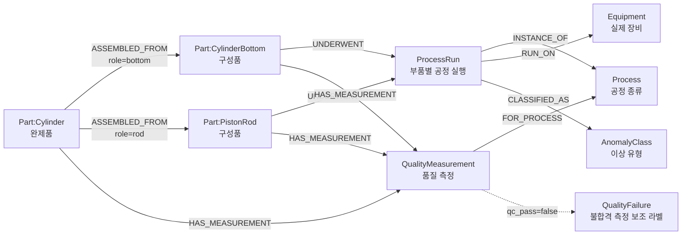

# CiP-DMD 최소 그래프 스키마 v1.1

## 문서 상태

- 단계: 3단계 — 최소 그래프 스키마 설계
- 상태: **완료**
- 기준 질문: `evaluation/gold_questions.yml` Q1~Q15
- 원칙: 실제 원본에 존재하고 핵심 질문에 필요한 개념만 그래프로 만든다.

## 1. 전체 구조



## 2. 노드

### `Part`

모든 완제품과 구성품의 공통 라벨이다. 종류별 보조 라벨을 함께 붙인다.

```text
(:Part:Cylinder)
(:Part:CylinderBottom)
(:Part:PistonRod)
```

| 속성 | 타입 | 필수 | 설명 |
|---|---|---:|---|
| `part_id` | string | 예 | 원본 고유 ID |
| `part_type` | string | 예 | `cylinder`, `cylinder_bottom`, `piston_rod` |
| `reworked` | boolean | 예 | reworked rod 원본 여부 |
| `source_file` | string | 예 | 원본 JSON 상대 경로 |

고유키: `part_id`

### `Process`

공정 종류를 중복 없이 관리한다.

| 속성 | 타입 | 필수 | 설명 |
|---|---|---:|---|
| `name` | string | 예 | 정규화된 공정명 |
| `display_name` | string | 예 | UI 표시명 |

값:

| `name` | 표시명 |
|---|---|
| `saw` | Sawing |
| `cnc_milling_machine` | CNC Milling |
| `cnc_lathe` | CNC Turning |
| `assembly` | Assembly |

원본 품질 그룹의 `cnc_mill`은 `cnc_milling_machine`으로 정규화한다.

### `Equipment`

원본 README에 명시된 실제 장비를 공정 실행과 연결한다. 개별 호기 ID는 없으므로
장비 모델 단위의 노드이며, 서로 다른 호기 간 비교를 의미하지 않는다.

| `equipment_id` | 장비명 | 공정 |
|---|---|---|
| `kasto-sba-2` | Kasto SBA 2 | saw |
| `dmc-50h` | DMC 50H | cnc_milling_machine |
| `index-c65` | Index C65 | cnc_lathe |

### `AnomalyClass`

원본 메타데이터의 anomaly code 0~3을 설명 가능한 분류 노드로 관리한다.

| 코드 | 의미 |
|---|---|
| `0` | 정상 공정 |
| `1` | 톱 절단 원재료 정렬 불량 |
| `2` | 밀링 지그의 불균일 체결 |
| `3` | 공정 데이터에서 보이지 않는 기타 오류 |

### `ProcessRun`

개별 부품에서 발생한 한 번의 공정 실행이다.

| 속성 | 타입 | 필수 | 설명 |
|---|---|---:|---|
| `run_id` | string | 예 | `{part_id}:{process_name}:{occurrence}` |
| `sequence` | integer | 예 | 해당 부품 안의 공정 순서 |
| `anomaly` | string | 예 | 원본 anomaly class |
| `start_time` | float | 아니오 | Unix timestamp |
| `end_time` | float | 아니오 | Unix timestamp |
| `sensor_file_count` | integer | 예 | 원본 `data_paths` 수 |

`cnc_lathe` 기록에는 시작·종료 시각이 없으므로 해당 속성을 만들지 않는다. 결측을 가상의 시각으로 채우지 않는다.

### `QualityMeasurement`

한 부품의 한 품질 feature 측정이다.

| 속성 | 타입 | 필수 | 설명 |
|---|---|---:|---|
| `measurement_id` | string | 예 | `{part_id}:{process_name}:{feature}:{occurrence}` |
| `feature` | string | 예 | pressure, surface_roughness 등 |
| `value_text` | string | 예 | 원본 값을 손실 없이 저장 |
| `value_numeric` | float | 아니오 | 숫자로 변환 가능한 경우 |
| `qc_pass` | boolean | 예 | 원본 합격 여부 |

`rework`처럼 범주형인 값은 `value_text`만 저장한다.
`qc_pass=false`인 동일 노드에는 `QualityFailure` 보조 라벨을 함께 붙인다.
별도의 불량 노드를 복제하지 않으면서 불합격 측정을 빠르게 조회하기 위한 표현이다.

## 3. 관계

| 시작 | 관계 | 끝 | 속성 | 방향 의미 |
|---|---|---|---|---|
| `Cylinder` | `ASSEMBLED_FROM` | `CylinderBottom/PistonRod` | `component_role` | 완제품에서 구성품으로 |
| `Part` | `UNDERWENT` | `ProcessRun` | 없음 | 부품에서 공정 실행으로 |
| `ProcessRun` | `INSTANCE_OF` | `Process` | 없음 | 실행에서 공정 종류로 |
| `ProcessRun` | `RUN_ON` | `Equipment` | 없음 | 실행에서 실제 장비 모델로 |
| `ProcessRun` | `CLASSIFIED_AS` | `AnomalyClass` | 없음 | 실행에서 원본 이상 유형으로 |
| `Part` | `HAS_MEASUREMENT` | `QualityMeasurement` | 없음 | 부품에서 측정으로 |
| `QualityMeasurement` | `FOR_PROCESS` | `Process` | 없음 | 측정에서 관련 공정으로 |

방향은 위 표대로 고정한다. 역방향 영향 분석은 반대 방향 관계를 추가하지 않고 Cypher에서 관계를 역으로 탐색한다.

## 4. 원본→그래프 매핑

| 원본 | 그래프 |
|---|---|
| `part_type`, `part_id` | `Part`와 subtype label |
| `Cylinder.component_ids[0]` | `ASSEMBLED_FROM {component_role: "bottom"}` |
| `Cylinder.component_ids[1]` | `ASSEMBLED_FROM {component_role: "rod"}` |
| `process_data[]` | `ProcessRun`, `UNDERWENT`, `INSTANCE_OF` |
| 공정명 + 원본 README 장비표 | `Equipment`, `RUN_ON` |
| `process_data[].anomaly` | `AnomalyClass`, `CLASSIFIED_AS` |
| `quality_data[].measurements[]` | `QualityMeasurement`, `HAS_MEASUREMENT`, `FOR_PROCESS` |
| `quality_data[].measurements[].qc_pass=false` | `QualityFailure` 보조 라벨 |
| `process_data[].data_paths` | 원본 경로 자체는 제외하고 `sensor_file_count`만 저장 |
| 생산 로그 XLSX | 개별 `part_id` 연결이 없어 1차 그래프에서 제외 |

## 5. 고유키 생성과 중복 처리

- `Part`: 원본 `part_id`
- `Process`: 정규화한 공정 `name`
- `ProcessRun`: `part_id + process_name + occurrence`
- `QualityMeasurement`: `part_id + process_name + feature + occurrence`
- 완전히 중복된 `CylinderBottom 103604` 레코드 1건은 적재 전 제거한다.
- placeholder인 `Cylinder 300001`은 적재하지 않는다.
- 존재하지 않는 구성품 참조는 가짜 노드를 만들지 않고 격리 로그에 남긴다.

## 6. 예상 그래프 규모

원본을 위 규칙으로 중복 제거한 예상치다.

| 항목 | 예상 수 |
|---|---:|
| Part | 2,736 |
| Process | 4 |
| Equipment | 3 |
| AnomalyClass | 4 |
| ProcessRun | 2,758 |
| QualityMeasurement | 7,570 |
| QualityFailure | 443(Measurement와 중복 라벨) |
| 전체 고유 노드 | 13,075 |
| ASSEMBLED_FROM | 1,569 |
| UNDERWENT | 2,758 |
| INSTANCE_OF | 2,758 |
| RUN_ON | 2,758 |
| CLASSIFIED_AS | 2,758 |
| HAS_MEASUREMENT | 7,570 |
| FOR_PROCESS | 7,570 |
| 전체 관계 | 27,741 |

실제 ETL 후 이 수치와 차이가 나면 적재 오류가 아니라는 근거를 로그로 설명해야 한다.

## 7. Gold 질문 경로 검증

| 질문 | 스키마 경로 | 판정 |
|---|---|---|
| Q1 압력 실패 상류 추적 | `Cylinder→Measurement`, `Cylinder→Component→Run/Measurement` | 가능 |
| Q2 거칠기 실패와 anomaly | `CylinderBottom→Measurement`, `CylinderBottom→Run→Process` | 가능 |
| Q3 완제품 genealogy | `Cylinder→Component→Run/Measurement` | 가능 |
| Q4 anomaly 역방향 영향 | `Process←Run←Bottom←Cylinder→Measurement` | 가능 |
| Q5 없는 완제품 | `Cylinder(part_id)` 조회 0건 | 가능 |
| Q6~Q15 장비·이상·불합격·완전성 | `Run→Equipment/Anomaly`, `Part→Failure` | 가능 |

## 8. 의도적으로 제외한 노드

- 개별 `MachineInstance`: 장비 모델은 알지만 호기별 고유 ID는 없다.
- 별도 `Defect` 엔티티: 원본은 불량 코드 대신 feature별 `qc_pass`를 제공하므로
  측정 노드에 `QualityFailure` 보조 라벨을 사용한다.
- `ProductionLogEvent`: 날짜·시간은 있으나 개별 `part_id` 연결 키가 없다.
- `SensorSignal`: 대용량 HDF5는 1차 MVP 범위 밖이다.
- `Lot`: CiP-DMD에 LOT 개념이 없다.

## 9. LLM에 전달할 스키마 표현

```text
Node properties:
Part {part_id: STRING, part_type: STRING, reworked: BOOLEAN, source_file: STRING}
Cylinder extends Part
CylinderBottom extends Part
PistonRod extends Part
Process {name: STRING, display_name: STRING}
Equipment {equipment_id: STRING, name: STRING, equipment_type: STRING}
AnomalyClass {code: STRING, name: STRING, description: STRING, is_normal: BOOLEAN}
ProcessRun {run_id: STRING, sequence: INTEGER, anomaly: STRING,
            start_time: FLOAT, end_time: FLOAT, sensor_file_count: INTEGER}
QualityMeasurement {measurement_id: STRING, feature: STRING,
                    value_text: STRING, value_numeric: FLOAT, qc_pass: BOOLEAN}
QualityFailure extends QualityMeasurement when qc_pass=false

Relationships:
(:Cylinder)-[:ASSEMBLED_FROM {component_role: STRING}]->(:CylinderBottom|PistonRod)
(:Part)-[:UNDERWENT]->(:ProcessRun)
(:ProcessRun)-[:INSTANCE_OF]->(:Process)
(:ProcessRun)-[:RUN_ON]->(:Equipment)
(:ProcessRun)-[:CLASSIFIED_AS]->(:AnomalyClass)
(:Part)-[:HAS_MEASUREMENT]->(:QualityMeasurement)
(:QualityMeasurement)-[:FOR_PROCESS]->(:Process)

Allowed Process.name:
saw, cnc_milling_machine, cnc_lathe, assembly
```

Text-to-Cypher 프롬프트에는 실제 Neo4j에서 조회한 스키마와 함께 위의 값 제한과 읽기 전용 규칙을 제공한다.
